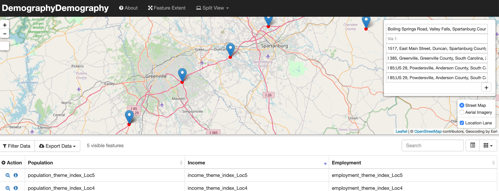
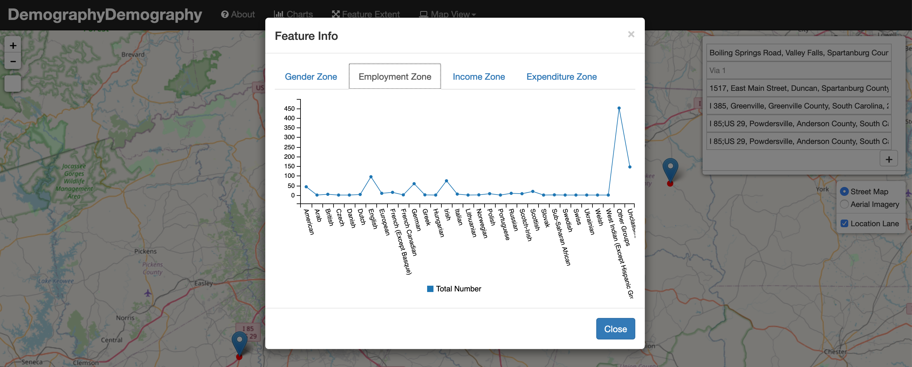

# Demography Dashboard

__

Simple Demogrphy Dashboard using Leaflet and charts

1. Flexible template built on active open source components
2. Entirely client-side, can be hosted for free on GitHub Pages
3. Built on the incredibly popular Bootstrap UI framework
4. Maps via Leaflet, the leading open source JavaScript mapping library
5. Interactive data table with sorting, searching, column toggling, and data export via the Bootstrap Table plugin
6. Advanced, interactive GeoJSON data querying that integrates jQuery QueryBuilder with AlaSQL
7. Advanced charting via C3.js, the D3-based reusable chart library

User can see different matrix in charts after click on particular location.
